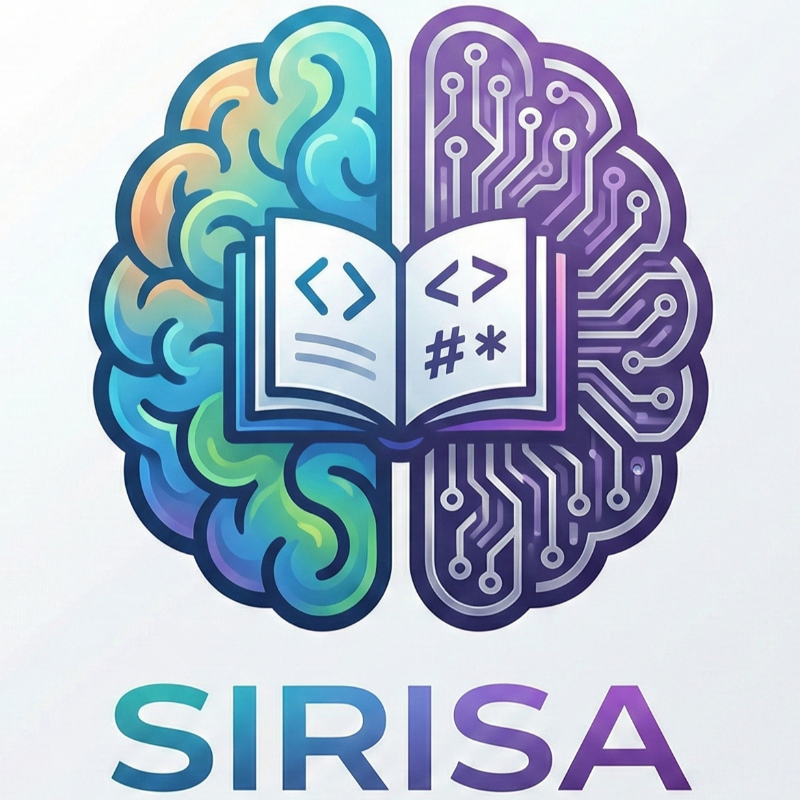

# 今回作成するWebアプリ **SIRISA** の概要
- 勉強の解法や疑問点を人間やAIが回答するアプリ
- Gemini APIを利用したAI回答
- 回答はテキストベースだけではなく、HTMLやmarkdown形式を使用した形式もサポート

| 従来のアプリ vs SIRISA | 特徴 |
|:-----------|:------------|
| 従来の質問回答アプリ       | 欲しい情報を短い文章で提供 |
| SIRISA       | 解法の過程をHTMLやmarkdown形式でじっくりと説明 |

:::message
SIRISAは、inputの学習において重要な学習過程を重要視したWebアプリ
:::

# 今日の流れ
1. 前回のテストのまとめ
2. デバッグ

# 1.前回のテストのまとめ
- 回答時のフォーマットが崩れている。
- アカウント作成時にメール認証を失敗すると、再度作成することができない。
- 質問投稿後の"questions/[数字]/"において、"AI回答を生成中です..."から進まない。

- アイコンが無い。

# 2.デバッグ

## アイコンの追加
GeminiのNano Banana Proを使用してアイコンを作成した。  
その際のプロンプトは次の[URL](https://gemini.google.com/share/d9f4ea9bfba9)である。  
また、作成したアイコンを以下に示す。

*アイコン*