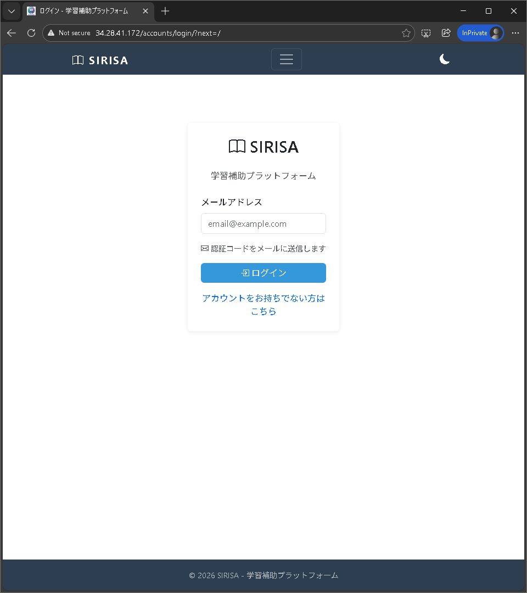

# 今回作成するWebアプリ **SIRISA** の概要
- 勉強の解法や疑問点を人間やAIが回答するアプリ
- Gemini APIを利用したAI回答
- 回答はテキストベースだけではなく、HTMLやmarkdown形式を使用した形式もサポート

| 従来のアプリ vs SIRISA | 特徴 |
|:-----------|:------------|
| 従来の質問回答アプリ       | 欲しい情報を短い文章で提供 |
| SIRISA       | 解法の過程をHTMLやmarkdown形式でじっくりと説明 |

:::message
SIRISAは、inputの学習において重要な学習過程を重要視したWebアプリ
:::

# 今日の流れ
1. 前回のテストのまとめ
2. デバッグ

# 1.前回のテストのまとめ

テストにおいて、以下の不具合が見つかった。

- 回答時の入力形式のフォーマットが崩れている。
- アカウント作成時にメール認証を失敗すると、再度作成することができない。
- 質問投稿後の"questions/[数字]/"において、"AI回答を生成中です..."から進まない。
- 自分の投稿画面において問題を未解決から解決済みに変更できない。
- AIの回答がmarkdown形式であるためHTMLの回答の前後に無駄なテキストが表示される。ここで、HTMLの回答部分を抜き出すために「\`\`\`html」から「\`\`\`」までを抜き出す処理をするなどの対策をしていない。
- 回答に対するリアクションの数の色が白すぎて見えにくい。
- AIの回答のHTMLがグラフィカルでない。HTMLをグラフィカルに表示し、グラフや表や画像などの挿入もAIに考慮させていない。
- パスワードが存在する。パスワードを廃止してその代わりに新規登録時とログイン時にメール認証を行うようになっていない。
- アカウントのマイページがない。マイページには、ユーザ名の変更やメールアドレスの変更やユーザの削除等を行えるようにする。
- ダークモードに対応していない。
- アイコンが無い。

# 2.デバッグ

## ログイン時のパスワードの廃止

*ログイン画面*

ログイン時のパスワードを廃止し、メール認証のみでログインできるようにした。
-> 要求通り

## アイコンの追加
GeminiのNano Banana Proを使用してアイコンを作成した。  
その際のプロンプトは次の[URL](https://gemini.google.com/share/d9f4ea9bfba9)である。  
また、作成したアイコンを以下に示す。

*アイコン*