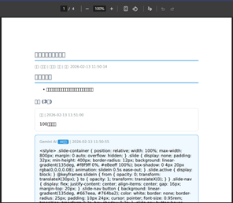
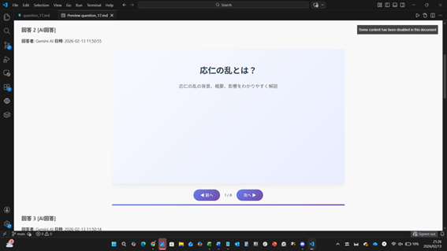

# 今回作成するWebアプリ **SIRISA** の概要
- 勉強の解法や疑問点を人間やAIが回答するアプリ
- Gemini APIを利用したAI回答
- 回答はテキストベースだけではなく、HTMLやmarkdown形式を使用した形式もサポート

| 従来のアプリ vs SIRISA | 特徴 |
|:-----------|:------------|
| 従来の質問回答アプリ       | 欲しい情報を短い文章で提供 |
| SIRISA       | 解法の過程をHTMLやmarkdown形式でじっくりと説明 |

:::message
SIRISAは、inputの学習において重要な学習過程を重要視したWebアプリ
:::

# 今日の流れ
1. 新規テストのまとめ
2. デバッグ
3. 追加機能の設計
4. 追加機能の実装
5. 追加機能のテスト

# 1. 新規テストのまとめ
テストにおいて、以下の不具合が見つかった。

野口の回答について、以下の回答を行った。

# A. 出力ファイルの確認
## A-1. PDF出力について
PDF出力については、日本語に対する文字化けが起こった。
以下がダウンロードして開いたPDFである。

## A-2. MARKDOWN出力について
MARKDOWN出力について、スライドが1p目のみしか、出力されないことが確認された。
以下の画面で、次へボタンを押した場合も、次のスライドへ遷移しない。

# 2. 返信機能のチェックについて
以下が、返信をするときに表示される画面である。

返信機能について、ボタンによる入力のみを受け付けることが確認された。

# 3. 解答の結果の閲覧について

# 4. 追加機能の設計
今回追加する機能は以下の通り。
- 任意のユーザ内でしか質問を共有できない小グループを作成できるようにする。
- 質問を投稿する際に、全世界に共有する質問か、小グループ内で共有する質問かを選択できるようにする。
- 回答に対する返信機能を追加する。
- 返信機能において、AIの返信を求める際に、メンションできるようにする。@aiでメンションできるようにする。
- 回答の文章に数式が含まれている場合は、そこをクリック可能にして、クリックするとその数式が導出される過程をAIによって生成して表示する機能を追加する。また、回答の文章中で、マウスによって範囲選択すると"AIに意味を聞く"という項目が表示され、そこをクリックすると、その単語をの詳しい説明をAIによって生成して表示する機能を追加する。この時、生成する文章はmarkdown形式にする。また、生成した文章は保存して選択部分をホバーすると表示されるようにする。文章の表示方法は小さな窓によるポップアップ表示にする。また、AIを呼び出す際には、選択部分の前後の文章も一緒に送信して、文脈を理解した上で説明を生成するようにする。
- 質問を回答する際に、単語の意味や数式の導出過程を自動的に補完して回答に含める機能を追加する。この際、補完する内容はAIによって生成し、markdown形式にする。また、補完した内容は保存して、回答部分をホバーすると表示されるようにする。文章の表示方法は小さな窓によるポップアップ表示にする。
- 使い方のページとFAQページと問い合わせページと利用規約ページとプライバシーポリシーページを追加する。
