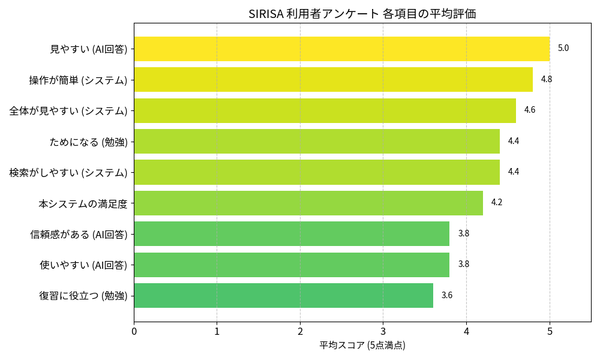

# SIRISA 利用者アンケート結果分析レポート

**対象:** 高専生および保護者（計6名）  
**実施日:** 2026年2月  
**分析:** SIRISA開発チーム

---

## 0. エグゼクティブサマリー

本アンケートにおいて、SIRISAは**総合満足度 4.2 / 5.0** という高評価を獲得しました。
上図の通り、「見やすい」「操作が簡単」といったUI/UX項目が突出して高いスコアを記録している一方で、「復習に役立つ」「信頼感がある」といった質的な項目が相対的に低くなっています。

この結果から、**使い勝手は完成されているが、コンテンツの質と資産化（アーカイブ）に課題がある**という現状が明確になりました。

---

## 1. 【成果】ユーザーが認めた「圧倒的な操作性」

システム設計における「使いやすさ」へのこだわりが、数字として実証されました。

### ① ストレスフリーな操作体験（Score: 4.8）
* **「操作が簡単」：4.8 / 5.0**
* **「全体が見やすい」：4.6 / 5.0**

> **分析結果:**
> 学生だけでなく、ITツールに不慣れな保護者層からも「操作が簡単」との回答を得ました。マニュアル不要で直感的に使えるUIは、SIRISAの最大の強みとして確立されています。

### ② 視認性の高いAI回答（Score: 5.0）
* **「回答が見やすい」：5.0 / 5.0（満点）**

> **分析結果:**
> 生成AIの出力表示に関して、全回答者から満点の評価を獲得しました。複雑なコードや解説文を適切に整形・可視化するフロントエンド処理が、ユーザーの理解を強力に支援しています。

---

## 2. 【課題】浮き彫りになった弱点と解決策

高評価の裏で、「コンテンツの質」と「資産化」については厳しい評価が下されました。これらを真摯に受け止め、具体的な改善策を提示します。

### ① 情報の信頼性と深さ（Score: 3.8）
* **「信頼感がある」：3.8 / 5.0**
* **「（内容的に）使いやすい」：3.8 / 5.0**

> **課題:**
> 「もっともらしいが、裏付けが弱い」「時事問題や専門外の領域で精度が落ちる」という指摘がありました。
>
> **▼ Action Plan:**
> * **推論モデル「Gemini Flash Thinking」の導入:** 思考プロセスを可視化し、論理的根拠を明示することで信頼性を向上させます。
> * **参照元の明確化:** 可能な限り情報ソースを提示する仕組みを検討します。

### ② 復習・アーカイブ機能の不足（Score: 3.6）
* **「復習に役立つ」：3.6 / 5.0**

> **課題:**
> システム名にある「Search Archive（検索・保管）」の機能が弱く、チャットが流れてしまい「見返しにくい」という現状があります。
>
> **▼ Action Plan:**
> * **キーワード検索・タグ機能の強化:** 「あの時の質問」に即座にアクセスできるデータベース構造へ刷新します。
> * **ストック機能の実装:** 重要な回答を保存し、自分だけの参考書を作れる機能を追加します。

---

## 3. 生成AIモデルに関するユーザー要望

* **Gemini Flash Thinking:** 60%以上のユーザーが利用を希望。
* **Gemini Flash / Pro:** 認知度が低く「わからない」との回答が多数。

> **方針:**
> ユーザーは「賢いAI（Thinking）」を求めています。デフォルトモデルをThinkingへ移行しつつ、他のモデルについては「速さのFlash」「バランスのPro」といった用途ごとのガイドラインをUI上で提示し、使い分けを促進します。

---

## 4. 結論：次期バージョンの開発方針

本アンケートにより、SIRISAは**ユーザからの見た目UIの完成度は極めて高いが、中身（AIの質・データ管理）に進化の余地がある**ことが判明しました。

次回アップデートでは、**信頼性向上**と**検索性（アーカイブ）強化**を行う新機能を追加し「使いやすい」だけでなく「成績が伸びる」システムへと進化させます。