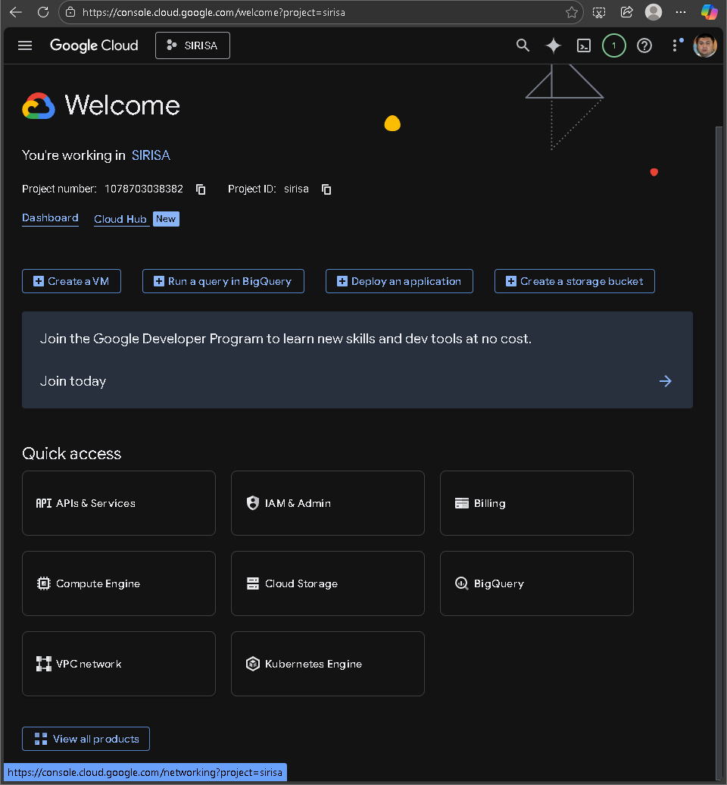
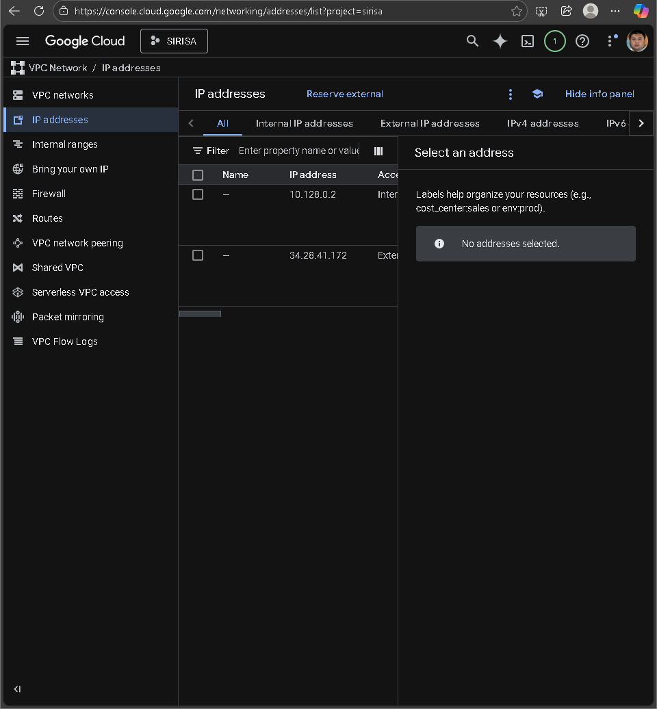
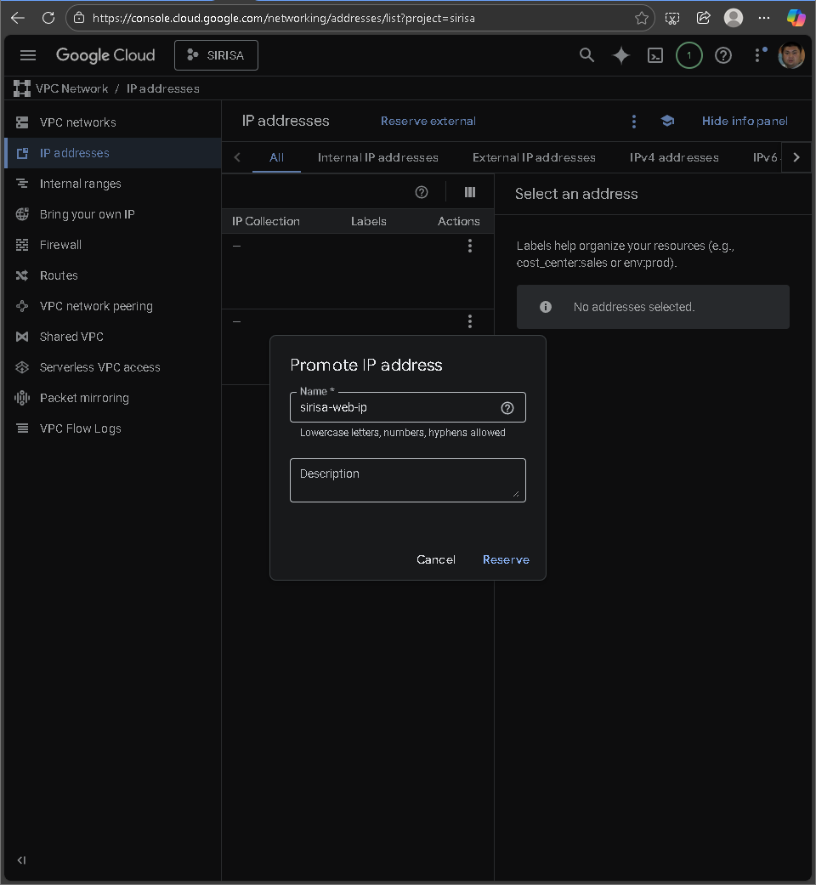
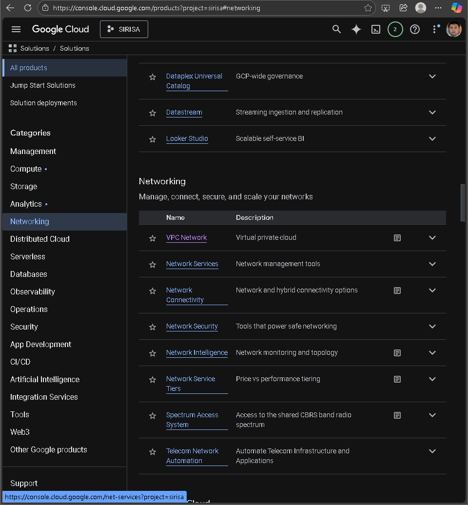

# 今回作成するWebアプリ **SIRISA** の概要
- 勉強の解法や疑問点を人間やAIが回答するアプリ
- Gemini APIを利用したAI回答
- 回答はテキストベースだけではなく、HTMLやmarkdown形式を使用した形式もサポート

| 従来のアプリ vs SIRISA | 特徴 |
|:-----------|:------------|
| 従来の質問回答アプリ       | 欲しい情報を短い文章で提供 |
| SIRISA       | 解法の過程をHTMLやmarkdown形式でじっくりと説明 |

:::message
SIRISAは、inputの学習において重要な学習過程を重要視したWebアプリ
:::

# 今日の流れ
1. 前回のテストのまとめ
2. デバッグ
3. ドメインの取得
4. https化

# 1.前回のテストのまとめ
テストにおいて、以下の不具合が見つかった。
- 新規登録において、削除したアカウントのユーザ名やメールアドレスを使用することができない。そのため、削除したアカウントの情報を保持する用のデータベースを確保しつつも、削除したアカウントのユーザ名やメールアドレスを再利用できるようにする必要がある。アカウントの復旧については人間が手動で行うためシステムによって復旧するようなシチュエーションは考慮する必要がない。
- HTTPであるため、セキュリティ面で不安がある。https化を行う必要がある。
- タークモードのホーム画面の「質問を投稿する」「自分の投稿一覧」「質問を探す」「最近の質問」などの文字が背景色と近いため見づらい。文字色を変更するなどの対策を行う必要がある。

# 3.ドメインの取得

今回は、SIRISAのドメインをCloud Domainsで取得した。

## 静的IPアドレスの取得

*コンソール画面*
1. コンソール画面において、VPC networkを選択する。

*IP Addresses*
2. VPC network内でIP Addressesを選択する。

*静的IPアドレスの取得*
3. External IP addressの欄で、Actionsの3点リーダをクリックして静的IPアドレスを取得する。

*静的IPアドレスの名前設定*
4. 名前を設定して、Reserveをクリックする。

## ドメインの取得

*Network Servicesの選択*
1. コンソール画面において、Network Servicesを選択する。
